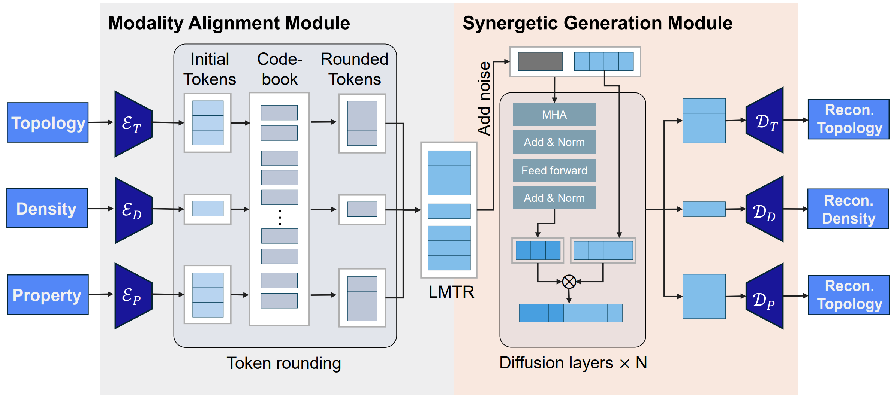

# UniMate
---
## DARPA WAR Summary

Assessing feasibility of scientific claims in the material science domain requires correctly modeling potentially novel material structure and accurately determining the material properties. We created UNIMATE, an advanced AI system for mechanical metamaterial modeling and design, which was accepted to ICML 2025, a leading venue in artificial intelligence research. UNIMATE is the first model to unify three core tasks in metamaterials research within a single framework, i.e., generating material structures, predicting their physical properties, and confirming whether they meet specific design constraints. It significantly outperforms prior methods across all tasks, including an 80% improvement in structural generation quality. This accomplishment marks a major step forward in machine learning for material validation and scientific discovery.
---


Mechanical metamaterials—engineered lattices whose behaviour is governed
primarily by geometry rather than chemistry—enable extraordinary
phenomena such as **negative Poisson’s ratio**, **ultra‑high
stiffness‑to‑weight**, and **programmable deformation paths**. These
capabilities are unlocking next‑generation solutions in aerospace
light‑weighting, soft robotics, energy absorption, and biomedical
implants. Designing such structures, however, is fundamentally harder
than designing conventional bulk materials: every candidate must
simultaneously satisfy *(i)* an intricate 3‑D **topology** (graph of
nodes and struts), *(ii)* a **relative density** field that tells how
much substrate is deposited, and *(iii)* the resulting **mechanical
property** tensor that captures Young’s, shear, and Poisson’s moduli.

State‑of‑the‑art machine‑learning pipelines tackle these aspects in
isolation or at most in pairs. A property predictor maps
`(topology → property)`, whereas a conditional generator attempts
`(property, density → topology)`. This fragmentation forces
practitioners to stitch together incompatible models, losing
cross‑modal correlations and making inverse design loops brittle. A
unified treatment has been elusive because the three modalities live in
heterogeneous spaces—graphs, scalars, and spectra—and each design task
may present *missing* pieces of information.

**UniMate** fills this gap. It is the **first end‑to‑end framework that
reasons over all three modalities in a single discrete latent space**. A
**Tripartite Optimal Transport (TOT)** module *aligns* topology,
density, and property tokens, while a **partially‑frozen diffusion
generator** *synergetically fills in* whichever subset is unknown.
Trained on our new 15 k‑sample benchmark dataset, UniMate outperforms
six strong baselines by up to **80 % in conditional topology
generation**, **5 % in property prediction**, and **50 % in condition
confirmation**.

> With UniMate you can:
>
> 1. **Generate 3‑D topologies** that satisfy user‑specified density &
>    mechanical criteria  
> 2. **Predict mechanical properties** of an existing structure under a
>    given density  
> 3. **Confirm viable density ranges** for a target structure & property
>    set




---

## ✨ Why UniMate?

| Challenge                              | UniMate’s Solution                                                         |
|----------------------------------------|----------------------------------------------------------------------------|
| **Multi‑modality** (topology / density / property) | **Unified encoder–decoder + diffusion backbone** represents all three modalities in a single token language |
| **Cross‑task flexibility**             | *Partially‑frozen* score‑based diffusion fills in **any** missing modality while preserving known context |
| **Sparse supervision**                 | **TOT alignment** tightens topology‑density‑property correlations, improving data efficiency |
| **Benchmark readiness**                | Ships with a **15 k‑sample** dataset and metrics for quality, accuracy, and correlation |

---

## 📂 Repository Layout

```text
UniMate/
├── config/                  # Experiment configs (YAML / dict)
├── dataset/                 # Cached `.pt` tensors
├── datasets/                # Builders & loaders
├── model/                   # Core architecture
├── utils/                   # Helper functions
├── train.py                 # Train UniMate
├── runner.py                # CLI for train / eval / generate
├── generate_structure.py    # Conditional topology generation
├── predict_properties.py    # Property prediction
├── input_structure.txt      # Demo structure for prediction
├── input_property.txt       # Demo property for generation
├── LICENSE
└── README.md                # ← you are here
```

---

## 🚀 Quick Start

```bash
# 3️⃣  Train
python train.py --config config/LatticeModulus_config_dict.py

# 4️⃣  Evaluate / generate
python generate_structure.py
python predict_properties.py
```

## 📚 Sample Use Case

Below is a minimal end‑to‑end walkthrough that shows how to use UniMate in practice.

### 1. Generate a Metamaterial Topology from Target Properties

```bash
# Specify the desired 12‑D property signature into input_property.txt.

# Produce a compliant structure
python generate_structure.py
# ⇒ topology saved to output_structure_0.txt
```

`input_property.txt` holds the twelve‑dimension mechanical target: the first three values are the relative Young’s moduli, the next three the shear moduli, and the last six the Poisson’s ratios.  
The generated lattice graph is saved in `output_structure_0.txt` and can be visualised with any CAD/graph utility.

### 2. Predict Mechanical Properties of an Existing Structure

```bash
# Provide a structure into input_structure.txt (within input_structure.txt a sample structure has already been written, which provides a template for the structure)
python predict_properties.py
# ⇒ predicted properties written to output_properties_0.txt
```

The script consumes a plain‑text node‑edge list in `input_structure.txt` and outputs the same 12‑D property vector described above.
---

## 📊 Quantitative Results

### Datasets & Baselines

* **Dataset.** Existing benchmarks do not jointly cover topology generation, property prediction, and condition confirmation. We therefore construct a new dataset derived from *Modulus* by (i) selecting a diverse subset of topologies, (ii) assigning multiple density conditions to each lattice, and (iii) computing full mechanical responses via finite‑element simulation (see the paper Appendix for details).
* **Baselines.** We compare UniMate with six strong alternatives:

  * **Generation‑oriented:** `CDVAE`, `SyMat` – both designed for periodic crystal structure synthesis.
  * **Prediction‑oriented:** `Equiformer`, `ViSNet`, `MACE+ve`, `UniTruss` – state‑of‑the‑art property predictors. We additionally adapt UniTruss for generation via its reconstruction head and re‑purposed the predictors for condition confirmation by forcing them to infer density.
* **Metrics.**

  * *Topology generation*: **F\*\*\*\*qua** (symmetry & periodicity) and **F\*\*\*\*cond** (topology‑ground truth matching).
  * *Prediction & confirmation*: **NRMSE** between predicted and ground‑truth values (lower is better).

### Effectiveness Comparison

| Model              | Fqua ↓ (×10‑2) | Fcond ↓ (×10‑2) | NRMSEpp ↓ (×10‑2) | NRMSEcc ↓ (×10‑2) |
| ------------------ | -------------- | --------------- | ----------------- | ----------------- |
| CDVAE              | 19.23          | 32.71           | N/A               | N/A               |
| Equiformer         | N/A            | N/A             | 5.31              | 38.05             |
| ViSNet             | N/A            | N/A             | 3.12              | 10.43             |
| SyMat              | 16.94          | 33.37           | N/A               | N/A               |
| UniTruss           | 19.43          | 33.77           | 2.71              | 8.89              |
| MACE+ve            | N/A            | N/A             | 2.57              | 9.09              |
| **UniMate (Ours)** | **2.74**       | **7.81**        | **2.44**          | **4.43**          |

**Key takeaways.** UniMate delivers consistent, large‑margin improvements across all three tasks. Against the strongest competitor in each column it achieves:

* **80.2 %** relative error reduction in conditional topology generation (Fqua),
* **5.1 %** lower prediction error on mechanical properties, and
* **50.2 %** lower error in condition confirmation.

These results highlight UniMate’s ability to *synergistically leverage* topology, density, and property information instead of treating them in isolation.

---

## 🔧 Minimal Dependencies

| Package | Purpose |
|---------|---------|
| **PyTorch ≥ 2.3** | Core tensor engine / CUDA |
| **PyTorch‑Geometric ≥ 2.5** | Graph message‑passing layers |
| **e3nn ≥ 0.6** | E(3)-equivariant ops in NequIP fork |
| **NumPy & SciPy** | Fast array maths / linear algebra |

---

## 📊 Citation

```bibtex
@inproceedings{zhan2025unimate,
  title     = {UniMate: A Unified Model for Mechanical Metamaterial Generation, Property Prediction, and Condition Confirmation},
  author    = {Wangzhi Zhan and Jianpeng Chen and Dongqi Fu and Dawei Zhou},
  booktitle = {Proceedings of the 42nd International Conference on Machine Learning},
  year      = {2025}
}
```

---

## Contact
Wangzhi Zhan, Virginia Tech PhD student, wzhan24@vt.edu

---

## Funding Details
This work is supported by the National Science Foundation under Award No. IIS-2339989 and No. 2406439, DARPA under contract No. HR00112490370 and No. HR001124S0013, U.S. Department of Homeland Security under Grant Award No. 17STCIN00001-08-00,  Amazon-Virginia Tech Initiative for Efficient and Robust Machine Learning, Amazon AWS, Google, Cisco, 4-VA, Commonwealth Cyber Initiative, National Surface Transportation Safety Center for Excellence, and Virginia Tech.

---

## 📄 License

Distributed under the MIT License.  See [`LICENSE`](./LICENSE) for
details.
